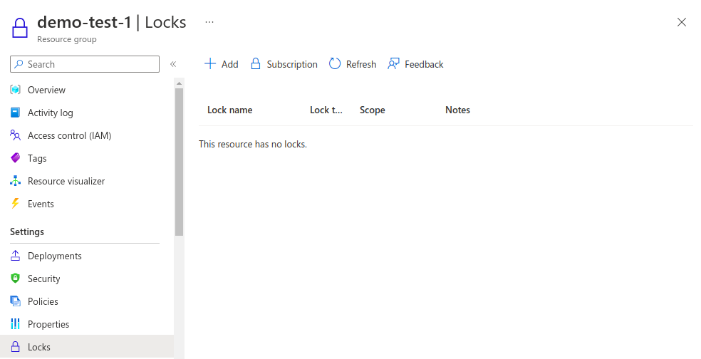
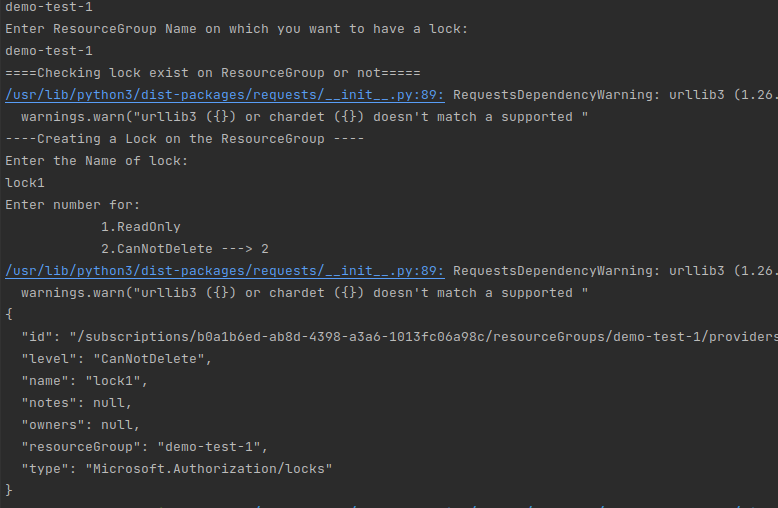
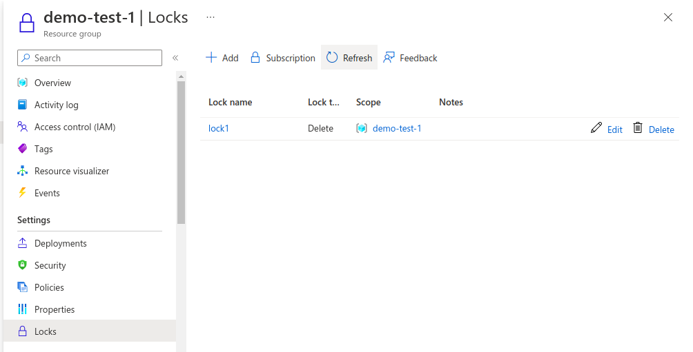
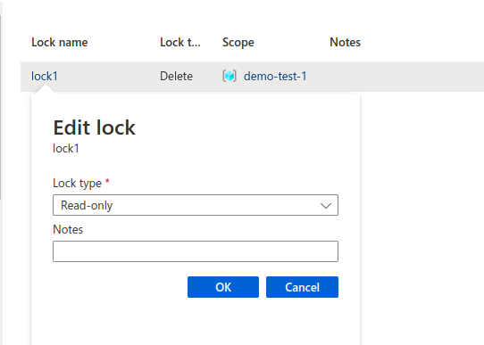

## Description

Here, In this template we will create the Lock on Resource Group of Azure using the shell script.

---

#### Pre-requisite

* AZ Account
* Azure CLI

---

### Steps:-
1. Login into AZ account using `az login` or `az login --tenant <TENANT-ID>`
2. Change the permission of the file `chmod a+x create-resource-group-lock.sh`
3. Go to the terminal and run the command `./create-resource-group-lock.sh`

---

### Outputs
* Here, In this output it's showing that there is no Lock on Resource group :

* Here, In this output we are creating a new lock on resource group :

* Here, In this output it's showing that there is a Lock on Resource group :

* With a read-only type:

---
